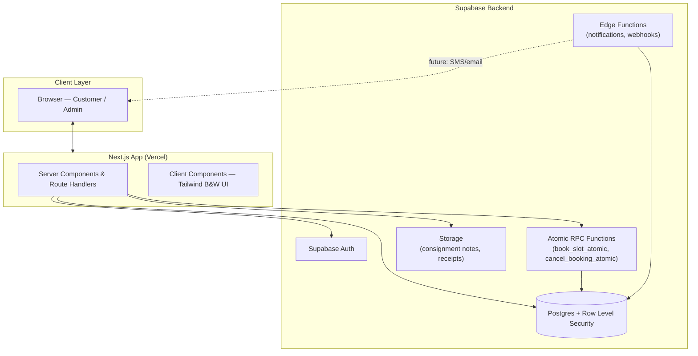
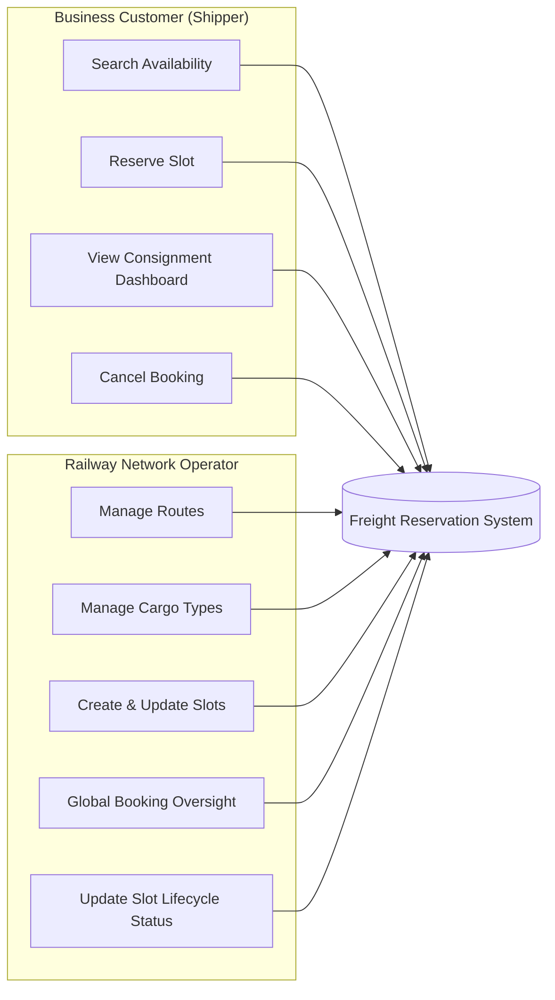
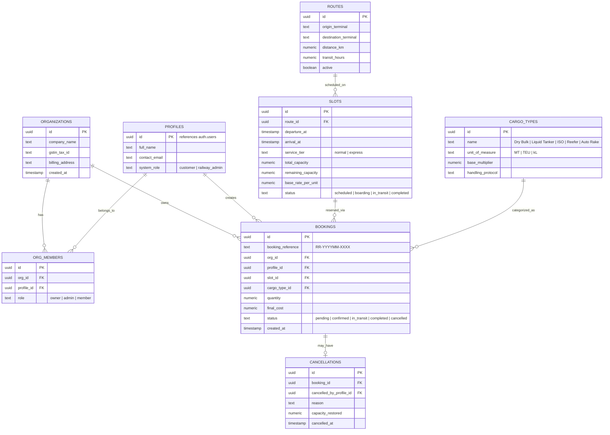
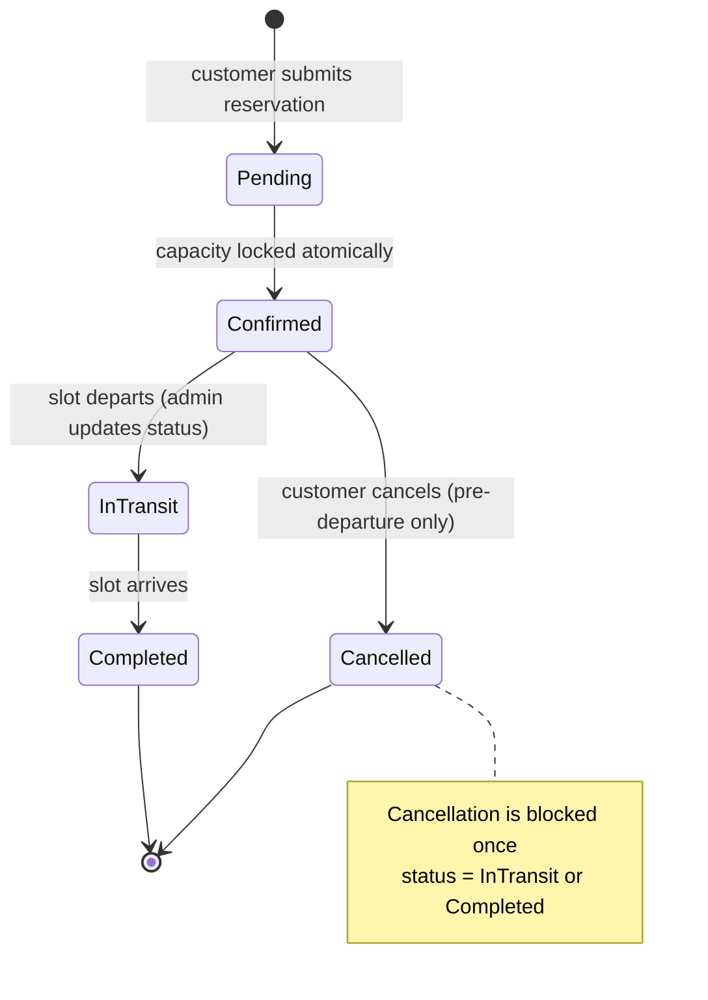

# Railway Commodity Reservation System (Freight IRCTC)

A production-grade, multi-tenant B2B platform for checking availability, booking, and cancelling cargo/bulk commodity freight slots on dedicated rail corridors — the freight equivalent of IRCTC.

---

## Table of Contents

- [Overview](#overview)
- [Tech Stack](#tech-stack)
- [System Architecture](#system-architecture)
- [Actor Model](#actor-model)
- [Database Design (ER Diagram)](#database-design-er-diagram)
- [Core Flow: Atomic Slot Booking](#core-flow-atomic-slot-booking)
- [Booking Lifecycle (State Diagram)](#booking-lifecycle-state-diagram)
- [Multi-Tenancy & Security Model](#multi-tenancy--security-model)
- [UI Theme](#ui-theme)
- [Local Setup](#local-setup)
- [Roadmap: Future Features](#roadmap-future-features)

---

## Overview

Businesses (shippers, logistics operators, manufacturers) currently coordinate rail cargo transport manually. This system digitizes that process end-to-end: search available freight slots by route/date/cargo type, reserve capacity with an atomic transaction guarantee, receive a confirmation reference, and manage cancellations — all scoped per organization with railway operators managing the underlying network inventory.

## Tech Stack

| Layer | Technology |
|---|---|
| Frontend | Next.js (App Router), TypeScript |
| Styling | Tailwind CSS — strict black & white theme |
| Backend | Supabase (Postgres, Auth, Storage, Edge Functions) |
| Data integrity | Postgres RPC functions with row-level locking (`FOR UPDATE`) |
| Deployment | Vercel |

---

## System Architecture



**Why this shape:** Next.js server components query Supabase directly using the authenticated session, so RLS enforces tenant isolation at the database layer rather than in application code — the same rule can never be bypassed by a bug in the frontend. All capacity-changing operations (booking, cancelling) go through Postgres RPC functions instead of raw inserts, so the "check capacity, then modify it" step is atomic and safe under concurrent bookings.

---

## Actor Model



Two roles share the same system with different scopes: **customers** are scoped to their own organization via RLS, while **admins** operate with elevated policy access across all organizations and inventory.

---

## Database Design (ER Diagram)



---

## Core Flow: Atomic Slot Booking

The trickiest correctness requirement in this system is preventing overbooking when multiple customers try to reserve the same slot at once. This is handled with a row lock inside a single Postgres transaction, exposed as an RPC.

```mermaid
sequenceDiagram
    actor Customer
    participant UI as Next.js App
    participant Auth as Supabase Auth
    participant RPC as book_slot_atomic (Postgres RPC)
    participant DB as Postgres (slots / bookings)

    Customer->>UI: Search availability (route, date, cargo, tier)
    UI->>DB: SELECT slots (RLS-scoped)
    DB-->>UI: Matching slots + remaining_capacity
    Customer->>UI: Select slot, enter quantity, confirm
    UI->>Auth: Verify session + active org membership
    Auth-->>UI: Session valid
    UI->>RPC: book_slot_atomic(slot_id, org_id, cargo_type_id, quantity)
    RPC->>DB: BEGIN; SELECT slot FOR UPDATE
    alt remaining_capacity >= quantity
        RPC->>DB: INSERT booking (status = confirmed)
        RPC->>DB: UPDATE slots SET remaining_capacity -= quantity
        DB-->>RPC: COMMIT
        RPC-->>UI: booking_reference (e.g. RR-202608-4821)
        UI-->>Customer: Booking confirmation + receipt
    else insufficient capacity
        RPC-->>UI: Error — capacity exceeded
        UI-->>Customer: Show error, refresh live availability
    end
```

The `FOR UPDATE` row lock means a second, near-simultaneous booking request against the same slot waits until the first transaction commits — so remaining capacity is always checked against the true current value, never a stale read.

---

## Booking Lifecycle (State Diagram)



This mirrors the corresponding **slot** lifecycle admins control (`Scheduled → Boarding/Loading → In Transit → Completed`), which is the source of truth that gates whether a booking can still be cancelled.

---

## Multi-Tenancy & Security Model

- Every business-data table (`bookings`, and anything derived from it) carries an `org_id`. RLS policies restrict `SELECT`/`INSERT`/`UPDATE` to rows where `org_id` matches an organization the requesting user belongs to (via `org_members`).
- `railway_admin` role profiles bypass the tenant filter through a separate policy, granting global visibility for inventory and oversight — but never blanket write access to another org's bookings without an explicit admin-scoped policy.
- Capacity-mutating actions never happen through direct table writes from the client — only through the `SECURITY DEFINER` RPC functions (`book_slot_atomic`, `cancel_booking_atomic`), which enforces the atomicity and constraint checks server-side regardless of what the frontend sends.

---

## UI Theme

Strict monochrome design system — no chromatic colors anywhere:

| Element | Treatment |
|---|---|
| Confirmed status | Solid black background, white bold text, check icon |
| Cancelled status | Dashed black border, strikethrough, cross icon |
| Scheduled / In Transit | Solid black border, clock icon |
| Express service | Solid black pill badge, lightning icon |
| Primary CTA | Solid black, white text |
| Secondary CTA | Outlined black on white, bold border |
| Typography | Inter (UI text), Geist Mono (references, codes) |

Hierarchy is carried entirely by weight, size, border style, and iconography — never by color.

---

## Local Setup

### Prerequisites
- Node.js 18+
- npm

### Installation

```bash
# Navigate to the project directory
cd path/to/your/project

# Install dependencies
npm install

# Run the development server
npm run dev
```

App runs at [http://localhost:3000](http://localhost:3000).

### Supabase Database Setup

1. Open the SQL Editor in your Supabase project dashboard.
2. Run `supabase/schema.sql` to create all tables, indexes, RLS policies, and the atomic RPC functions.
3. Run `supabase/seed.sql` to seed initial freight corridors, cargo classifications, and scheduled slots.
4. Add your Supabase project URL and anon key to `.env.local`:

```bash
NEXT_PUBLIC_SUPABASE_URL=your-project-url
NEXT_PUBLIC_SUPABASE_ANON_KEY=your-anon-key
```

---

## Roadmap: Future Features

Grouped by how much they change the system's shape — nearer-term additions first.

**Near-term (extends current model)**
- Partial cancellations (reduce quantity instead of full cancel)
- Waitlist queue for fully-booked slots, auto-notify on cancellation-freed capacity
- Downloadable PDF consignment notes and e-way bills via Supabase Storage
- Email/SMS notifications on booking, cancellation, and status change (via Edge Functions)
- Admin analytics dashboard: slot utilization %, cancellation rate, demand by route/cargo type

**Mid-term (new subsystems)**
- Payment gateway integration (Razorpay/Stripe) with invoice generation and GST compliance
- Contract-based / negotiated pricing tiers per organization (volume discounts)
- Multi-leg bookings across interchange routes (single reservation spanning multiple slots)
- Role-based permission expansion within an org (e.g. booking-only vs. billing-admin members)
- Public read-only API for third-party logistics platforms to query availability

**Long-term (major capability additions)**
- Live GPS/RFID tracking of rakes with real-time transit status on the customer dashboard
- Dynamic/surge pricing based on route demand and remaining capacity
- Reefer cargo temperature monitoring integration with threshold alerts
- Native mobile app (React Native) sharing the same Supabase backend
- Multi-language support for regional freight operators
